# 每日竞价与收盘对照的持续算法优化手册

适用版本：1.7。本文说明怎样把每天真实记录的早盘竞价与收盘涨停池进行可复现对照，并让其他 AI 在不接触保留期、不覆盖原始证据、不自动修改实盘参数的前提下提出改进建议。

当前系统已经支持持续采集、每日冻结、收盘贴标签、历史重放、内置权重实验、开发集导出和外部建议归档。它**尚未实现**“外部提案 → 封存一段未来日期 → 自动验证 → 批准/拒绝 → 关联应用”的状态闭环。保存提案不等于验证通过，验证通过也不等于用户已经采用。本文将已实现流程和仍需人工治理的步骤分开说明。

## 1. 优化问题的准确含义

当前研究问题是：

> 在每个交易日 09:24:50，当候选固定为上一交易日完整涨停池时，用截止该时点真实收到的竞价七因子排序，排名靠前的股票在当天 15:10 后取得的完整涨停池中占比如何？不同权重能否在按日期切分的样本上稳定优于当前权重？

这不是收益回测，也不回答能否成交。收盘 `label=true` 只表示股票属于该日完整涨停池，不表示可以买到、次日盈利或涨停概率。系统没有模拟手续费、滑点、排队、开板卖出、停牌或仓位。

当前固定七因子：

| 键 | 中文含义 | 默认权重 |
| --- | --- | ---: |
| `gap` | 竞价溢价 | 0.15 |
| `amount` | 竞价金额 | 0.15 |
| `turnover` | 竞价换手 | 0.10 |
| `volume_ratio` | 竞价量比 | 0.10 |
| `late_momentum` | 后五分钟价格斜率 | 0.20 |
| `retention` | 前五分钟峰值金额留存 | 0.15 |
| `continuity` | 昨日严格连板梯队 | 0.15 |

公式、饱和值和缺失处理见 [STRATEGY](STRATEGY.md)。日线个股分和趋势筛选分是另外两套模型，不能拼进七因子排名或共用同一“准确率”。

## 2. 每日证据链

```mermaid
flowchart LR
    A[09:15前冻结盘前清单] --> B[09:15—09:25 每批先落盘]
    B --> C[每批立即评分与发布]
    C --> D[09:24:50 研究时点]
    D --> E[09:26 终态诊断]
    E --> F[09:27 不可变竞价日档]
    F --> G[15:10后完整收盘涨停池]
    G --> H[独立收盘核验版本]
    H --> I[本机时间切分实验]
    I --> J[development_only 数据]
    J --> K[外部AI权重建议归档]
    K --> L[未来新日期人工治理验证]
    L --> M[用户决定是否应用]
```



### 2.1 盘前：冻结当时真正知道的内容

建议 09:05 前启动，09:10 前完成准备。准备阶段保存：

- 会话日和官方交易日历；
- 上一交易日及其完整涨停池上下文；
- 当时计划采集的完整股票代码；
- 当前七因子权重；
- `prepared_at`、`context_complete` 和 `point_in_time`。

清单写入 SQLite 的 `research_manifests`，首次记录后不覆盖。`prepared_at` 晚于 09:15、上一交易日不相邻、池不完整或上下文日期不符时，仍可作回溯说明，但不能进入严格优化。

### 2.2 竞价：原始批次先保存，再计算

09:15—09:25，每个 API 批次独立处理：

1. 在将下一批请求发出前，检查是否到达时点边界；
2. 将实际 `received_at`、阶段、原始响应白名单和 `_strategy_weights` 保存到 `batches`；
3. 立即调用 `AuctionEngine.ingest`；
4. 立即更新页面/SSE 排名；
5. 保留延迟、拒绝、乱序、重复、缺失和覆盖诊断。

不得把所有批次收齐后再统一打分。批次中的上游 `timestamp` 不能代替本机 `received_at`。

### 2.3 固定两个时点

- `09:24:50`：参数研究的唯一主时点，只允许使用该时刻前已收到的数据。
- `09:26:00`：包含 09:25 终态收尾的诊断时点，不能参与 09:24:50 的选参。终态复核窗口实际持续到 09:26:50；该时点的重放包含所有接收时间 ≤09:26:00 的批次，因此晚到的真正终值只要在 09:26:00 前收到就会进入档案，之后的复核轮只更新会话视图与原始批次。

如果引擎尚未摄入截止之后的批次，服务保存当时真实排名，`method=recorded_ranking`。旧数据没有合格排名时，才按截止前批次和当时权重重放，`method=replayed`。两者必须分开陈述。

09:25 过后约一分钟，服务还会写出 `data/research/daily/YYYY-MM-DD-morning-ranking.md`：它直接取每批到达后立即计算的引擎排名（含 `provisional_score`、数据阶段与是否为昨日涨停候选），在 09:26 分钟内最多每 20 秒刷新一次，并声明自己是可刷新视图、不是不可变证据。该文件不参与样本筛选，也不能被当作原始评分证据；收盘标签只挂在 09:27 冻结档案和之后的核验版本上。

### 2.4 09:27：冻结竞价档案

`data/research/daily/YYYY-MM-DD-auction.json` 只写一次，核心字段：

```text
schema_version: 1
kind: 'auction_snapshot'
status: 'frozen'
date, mode: 'live', frozen_at, frozen_id, scope: 'previous_limit_up_only'
engine_source_sha256, manifest_sha256, batches_sha256, batch_count
field_coverage, sessions[], definition, warnings[]
```

`sessions` 分别保存两个时点的权重、来源、每股七因子、分数、质量和缺失。同一对象同时渲染出人读 `data/research/daily/YYYY-MM-DD-auction.md`（权重来源、覆盖、排名、因子覆盖与标签），Markdown 与冻结 JSON 都只写一次，供人直接查看当日排名，不需要先手动导出。其他 AI 没有创建或补写冻结档案的 HTTP 接口；缺盘前清单或真实批次时只返回 `unavailable`。

`field_coverage` 按当日原始批次记录关键上游字段（量比、换手、相对昨日成交量比例、未匹配量、开盘价）的可得性：有值批次数、首次/最后有值时间，以及在 09:24:50 与 09:26:00 两个时点各有多少候选真正取值（按引擎“最新一次观察”语义）。它是判断某日能否进入“七因子齐全”共同样本的审计依据：2026-09-21 与 09-22 实测 `auction_volume_ratio` 只在开盘首条快照、个别换手缺失个股与完整终态整批响应中出现，主时点分别仅 0/77 与 1/103 候选有值，因此这两日不能作为七因子完整样本；缺失保持缺失，不用相对昨日成交量比例替代。

**当前决定（2026-09-23，方案D→B）：** 先按方案D核对上游：官方完整指南里 `volume_ratio` 只出现在集合竞价字段表，行情快照没有量比/换手率字段，确认没有替代接口来源；随后执行方案B——**同一会话内、最近一次有效值且年龄≤600秒的有界携带**参与评分。因此 09:24:50 主时点不再必然缺该因子：共同样本仍按“七因子分齐全”判定，携带行同样计入，但逐行保留 `value_source='carried'`、`value_age_seconds`、`carried_from`，实验 `sample_summary.volume_ratio_carried_rows` 统计并在警告中披露，日档 `field_coverage.checkpoints[].volume_ratio_carried_rows` 同步留证。超过600秒、跨日或从未取得有效值仍保持缺失；不得把携带值说成上游在 09:24:50 提供的量比，也不得据此放宽30日/300股日门槛。逐日可得性继续用 `python tools/field_coverage_report.py --days 10` 审计，需要时与携带行数分开比较。

已冻结档案只能被读取，不能被重写。若某日整日不可评分确实源于此后修复的归一化或实现缺陷，维护者可用只读本机数据的 `tools/rebuild_daily_ranking.py --date ... --reason ...` 生成独立校正版本：它按当日原始批次、当时权重和当前引擎源码重放，保留 `corrects_frozen_id`、`reason`、`supersedes` 与引擎摘要，并明确声明不是当时页面已发布的原分；重放后仍无可评分记录时拒绝写入。15:10 核验只在同一冻结档案的校正版本确有可评分行时把标签加到重建分数上，并记录 `scores_basis=correction`。校正不是补采：它不能把当时未观察的股票变成已观察，也不能把校正分数当作当时的实时发布记录。

### 2.5 15:10 后：只把收盘结果贴成标签

收盘复盘取得目标日完整涨停池并完成日期、完整性、代码唯一性检查后，`DailyValidation.label` 生成新文件：

```text
kind: 'daily_validation'
status: 'ready'|'partial'
matched_at, report_generated_at, outcome_verified, outcome_sha256, id
```

每股 `label`：

- `true`：属于同日核验后的完整涨停池；
- `false`：完整池已核验，且不在池内；
- `null`：结果池缺失或不合格，保持未知。

收盘标签不改变原分、因子、候选或排名。`false` 不表示亏损，`true` 不表示可成交。标签版本使用新 ID，不覆盖 09:27 冻结版。

## 3. 每日操作清单

### 交易日前/早盘

- 确认同花顺连接已验证、系统为 `live`、自动复盘已开启。
- 09:10 前准备重点池；确认前一交易日正确、候选数量合理。
- 09:10—09:26 不运行 LLM、回测、导入、历史大导出或板块批量取数。
- 保持程序、电脑和网络运行；缺失的历史竞价无法事后从收盘数据补回。

### 09:27 后

读取：

```http
GET /api/research/daily?date=YYYY-MM-DD
```

检查 `status`、`frozen_id`、两个 `sessions`、`method`、`strategy_provenance`、`quality` 和 `warnings`。此时没有收盘标签是正常的。

### 15:10 后

等待自动复盘，或显式请求：

```http
POST /api/review
X-Local-App: auction-lab

{"date":"YYYY-MM-DD"}
```

任务完成后再次读取每日档案，要求：

- `kind == 'daily_validation'`；
- `outcome_verified == true`；
- 主会话 `checkpoint == '09:24:50'`；
- `quality.eligible_for_optimization == true`；
- `label` 均为布尔值；
- 没有无效批次、引擎拒绝记录或倒序响应。

不满足时保留证据和警告，但不强行纳入优化。

## 4. 内置历史实验怎样防止过拟合

`POST /api/research/run {}` 会捕获提交时当前权重，在本机读取不可变证据并重放，不调用金融 API 或模型。其硬约束为：

| 约束 | 当前规则 |
| --- | --- |
| 主时点 | 09:24:50 |
| 共同样本 | 原基线可评分且七因子都完整的同一股票日集合 |
| 最少完整日期 | 30 日 |
| 最少完整股票日 | 300 |
| 开发集类别 | 正例、负例各至少 30 股票日 |
| 日期划分 | 按时间顺序，不随机拆同日股票 |
| 保留期 | 最后 20%，向上取整且至少 5 日 |
| 开发验证 | 三折向前扩展；初训至少 10 日，每折验证至少 3 日 |
| 候选数量 | 固定种子 `20260921`，最多 64 组 |
| 选择目标 | 每日 Precision@min(10,N) 的均值 |
| 接受门槛 | 验证增益 > 0；保留期至少 +3 个百分点；至少 60% 保留日期优于基线 |

所有候选使用完全相同的共同样本。某因子权重降为 0，也不能因此把缺该因子的股票加入样本。样本不足、基线胜出、保留日期已复用或任一门槛失败时，`recommendation.accepted=false`。

同时查看以下指标，不要只看一个命中率：

- 完整日期、共同股票日、正负数量；
- 每日 Precision@K 与合并 Precision；
- 候选池基准占比、捕获比例和 lift；
- 每日增益分布，而非只看总均值；
- 因子缺失、排名覆盖、候选数和被排除原因；
- 三折验证是否同方向；
- 留出期增益和改善日期比例；
- 市场环境、连板高度、板别和候选池大小的诊断稳定性。

分组诊断不能继续用来在同一保留集上挑规则，否则保留集已经变成开发集。

## 5. 外部 AI 的安全优化流程

### 第一步：运行并固定实验

```powershell
$auctionBase = 'http://127.0.0.1:8765'
$auctionHeaders = @{ 'X-Local-App' = 'auction-lab' }
Invoke-RestMethod -Method Post -Uri "$auctionBase/api/research/run" `
  -Headers $auctionHeaders -ContentType 'application/json' -Body '{}'
```

检查 `/api/state.jobs.research`。只有 `done` 后读取 `/api/research`；`error` 时保留的是上一次实验，不能冒充本次结果。

记录：

- `experiment.id`；
- `reproducibility.dataset_sha256`；
- `reproducibility.source_sha256`；
- `baseline_weights`；
- `status` 和全部 warnings；
- 开发/留出日期和保留复用状态。

### 第二步：只导出开发集

```http
GET /api/research/ai-dataset?id=<experiment_id>
```

先检查：

```text
schema_version == 1
scope == 'development_only'
experiment_id 与请求一致
sessions 非空
每个 session.checkpoint == '09:24:50'
每个 session.quality.eligible_for_optimization == true
每个 row.label 为 boolean
```

完整实验、每日 JSON 和 `/api/research/history` 可能含保留期标签，只能审计，不得继续交给选参模型。

### 第三步：要求模型输出可审计建议

外部 AI 的回答应包含：

1. 模型/版本和提示词版本；
2. `experiment_id` 与 `dataset_sha256`；
3. 使用的开发日期、共同样本数和正负数量；
4. 基线指标与候选指标；
5. 每折结果和最差阶段；
6. 缺失、排除和数据偏差；
7. 七键完整非负权重；
8. 可能证伪建议的条件；
9. 需要多少未来新日期；
10. 明确声明没有读取保留标签，且不会自动应用。

当 `sessions=[]` 或证据不足时，正确输出是“保持当前参数并继续收集”，不是猜一组新权重。

### 第四步：归档建议

```http
POST /api/research/proposals
Content-Type: application/json
X-Local-App: auction-lab

{
  "experiment_id": "24位实验ID",
  "weights": {
    "gap": 0.15,
    "amount": 0.15,
    "turnover": 0.10,
    "volume_ratio": 0.10,
    "late_momentum": 0.20,
    "retention": 0.15,
    "continuity": 0.15
  },
  "source_model": "服务商/模型/提示词版本",
  "rationale": "开发集证据、局限、未来验证计划"
}
```

返回 `status='awaiting_future_validation'` 和 `automatically_applied=false`。同内容重复提交使用同一建议 ID，不覆盖首次提交时间。

## 6. 当前持续验证闭环的限制

必须向后续 AI 如实说明两个限制：

1. `proposals` 目前只有提交和读取，没有“开始未来验证、通过、拒绝、批准、应用、回退”端点；优化器也不会自动读取外部提案。
2. 自动收盘流程会每日运行研究。首次达到门槛后，实验把当时最后 20% 日期登记到 `holdouts.json`；下一日滚动实验的保留块通常与旧保留日期重叠，因此会标为 `exploratory_holdout_reuse`。日常滚动报告适合持续观察，但不能每天都宣称获得一份新的独立样本外验证。

所以当前正确闭环是：

- 每日继续采集和生成描述性/探索性报告；
- 外部 AI 的建议只归档；
- 人工为某个提案预先登记一段**此前未向模型展示**的未来日期；
- 在该期间不依据中间结果修改提案；
- 未来样本达到预设数量后，由维护任务用冻结提案做一次验证；
- 保存验证使用的日期、旧/新权重、基线、结果、Git 提交和用户决定；
- 在专用闭环实现前，不把 `awaiting_future_validation` 改称已验证或已采用。

建议后续版本新增独立的提案生命周期，而不是复用每日滚动 holdout：

```text
awaiting_future_validation
→ validation_window_registered
→ validating
→ passed | rejected | inconclusive
→ user_approved
→ applied | rolled_back
```

注册时应冻结 `proposal_id`、基线权重、未来开始日、最少日期/股票日、评价指标和阈值；只有窗口结束才解封标签。普通每日实验不应消耗这段封存数据。该功能尚未实现，其他 AI 不能通过直接修改 JSON 模拟它已经实现。

## 7. 人工采用权重的最低流程

即使内置 `recommendation.accepted=true` 或未来人工验证通过，也不自动应用。用户明确决定采用后：

1. 停止监测，等待全部任务结束；
2. 备份 `data/` 和 `data/config.json`，不加入 Git；
3. 记录提案 ID、实验 ID、验证日期、旧权重、新权重和决定人；
4. 通过页面保存，或显式调用 `/api/config` 的完整七键 `weights`；
5. 重新读取 `/api/state.config.weights` 核对归一化结果；
6. 重新准备股票池再启动；
7. 将切换时间视为新策略版本起点，旧日档仍保留旧权重/旧源码；
8. 预先定义回退条件，不因单日结果追涨杀跌式改参。

`/api/config` 会重建引擎并清除当前准备和会话内存，因此不能在竞价中途调用。它不会改变旧实验，也不会更新 proposal 状态。维护记录必须补足关联。

## 8. 新因子或公式修改

`/api/research/proposals` 只接受七个现有权重，不能表达新字段、新公式、阈值或候选池变化。此类建议属于源码变更，至少先写一份设计提案：

```text
proposal_kind: factor_or_formula_change
base_git_commit:
algorithm_version:
factor_key / 中文名:
数据源和授权:
单位:
最早可用时点:
公式与截断范围:
缺失/异常处理:
与现有因子的重复性:
未来信息泄漏检查:
受影响模块和历史兼容:
开发/验证/未来样本计划:
运行耗时与竞价路径影响:
测试清单:
回退方案:
```

实现时同步 `engine.py`、默认配置、回放、优化、界面、`STRATEGY.md`、`CONTRACT.md`、接口文档和测试。旧日档的因子集合不能被原地升级；新版本实验要保留算法版本、源码摘要和 Git 提交。

## 9. 外部 AI 提示词模板

```text
你是竞价算法研究助手。只能分析我提供的 schema_version=1、scope=development_only 数据。

目标：比较固定七因子权重在上一交易日完整涨停池候选中的 09:24:50 排名识别能力。
标签：同日15:10后完整涨停池成员，仅作布尔结果；不是收益、概率或可成交性。

硬规则：
1. 不推断、请求或重建保留期标签。
2. 不使用09:26数据选择09:24:50参数。
3. 不随机拆同日股票；按完整交易日顺序验证。
4. 所有候选使用相同七因子完整共同样本；缺失不补零。
5. 不修改原始行、标签、候选池或时间。
6. 只输出七个既有因子的有限非负权重；不自动应用。
7. 样本不足或结果不稳定时明确建议保持基线。

请输出：实验ID、数据摘要、使用日期和样本量、基线、候选、逐折结果、缺失与偏差、建议权重、证伪条件、未来验证计划。最后给出可提交到 /api/research/proposals 的JSON。不要输出或索取任何API Key。
```

## 10. 永久禁止的做法

- 用今天收盘涨停股反选今天早晨候选；
- 把 09:26 终态或截止后的批次放进 09:24:50 因子；
- 用开盘价、当前快照、风向标或演示数据补造缺失历史竞价；
- 随机把同一天股票拆进训练和测试；
- 删除缺失、失败或负样本以提高命中率；
- 降低 30 日、300 股票日、开发集正负各 30 的门槛来得到结果；
- 看过保留集后继续调参，再把同一日期称为独立验证；
- 删除 `holdouts.json`、旧实验或原始批次制造“新”检验；
- 把 Precision@10、涨停成员识别率称为收益率或保证；
- 让 LLM 直接修改实盘权重或在 09:10—09:26 运行重任务；
- 把演示、重建、导入和真实本机样本混为一个来源；
- 只报告最好的一组参数，不披露基线、日期、样本、缺失和失败候选。

持续优化的价值来自长期保存真实时点证据和拒绝事后解释，不来自每天都产生一组不同权重。数据不足时保持原算法，是系统正确工作的结果。
